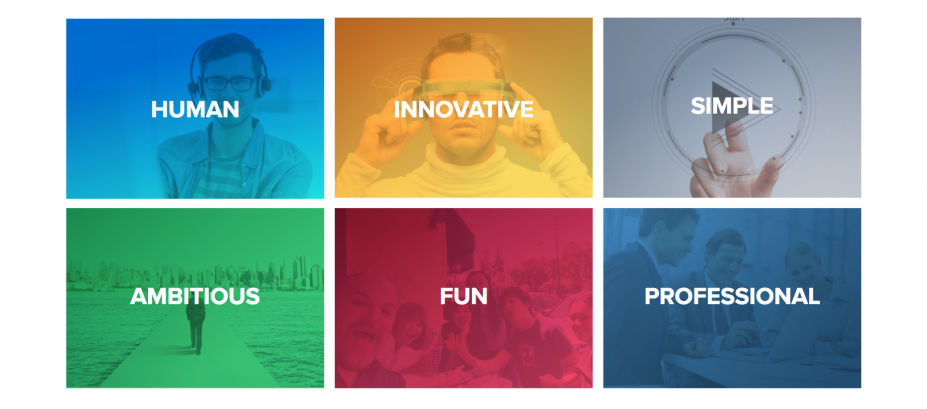
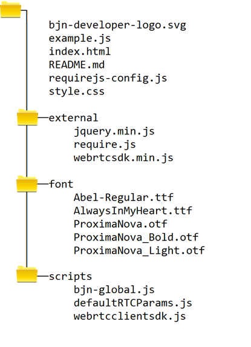

# WebRTC Client SDK




Document Version: 0.9.1

Document Date: 2017-05-02

| Version | Date      | Who  | Description                              |
| ------- | --------- | ---- | ---------------------------------------- |
| 0.9.0   | 4/27/2017 | g1   | Initial Checkin of Client SDK doc        |
| 0.9.1   | 5/2/2017  | g1   | Clean-up typos.  Add revs to S/W modules |


now br's
<br />
<br />
<br />
<br />

#   Introduction

Adding video calling ability to your own web page creates a connection between your business and your customers in a very personal way. The BlueJeans Web Real Time Communications (RTC) Client Software Development Kit (SDK) gives developers a quick and easy way to bring video-calling into a web page utilizing:

-   Simple Client Model for fast integration into your web site

-   Industry standard Web RTC Framework supported by many of the popularly available browsers like Google Chrome, Mozilla Firefox, and others.

-   Video connectivity over the internet using BlueJean Networks quality global video offering.

The WebRTC Client SDK enables application programmers to create rich video calls ***without*** the need to know great details behind video technology. You can focus on your business application needs and let BlueJeans take care of the video calling.

  

## Requirements

The requirements to create applications embedded with BlueJeans Web RTC SDK are listed below. The technology requirements are:

| Technology Requirement   | Condition             | Minimum                 |
| ------------------------ | --------------------- | ----------------------- |
| **Browser Support**      | Google Chrome         | Ver. 58.0.3029 or later |
|                          | Firefox               | (pending)               |
| **Code Development**     | Javascript, HTML, CSS |                         |
| **Installed Frameworks** | JQuery                | ver 1.82 or later       |
|                          | Require JS            | ver 2.11 or later       |

  

Additionally, these business conditions must be in place in order for your customers to make BlueJeans video calls from your web page:

| Business Requirement     | Condition | Description                              |
| ------------------------ | --------- | ---------------------------------------- |
| Domain whitelisting      | Req'd     | BlueJeans must add your hosting website to its domain whitelist for WebRTC calls.  The standard for Web Security (CORS) requires this whitelisting.  Contact [BlueJeans support](mailto:Support@bluejeans.com) when ready to be added to the whitelist. |
| Preassigned Meeting Pool | Opt'l     | BlueJeans allocates a finite pool of meetings that your web page connects for video sessions |
| onVideo API Scheduling   | Opt'l     | Hosting web site makes backend API calls utilizing BlueJeans onVideo API’s to schedule meetings. |

  

  

  

#   What Is Included in this SDK

BlueJeans provides this Software Development Kit with the following code and related files:

| File                    | Description                              |
| ----------------------- | ---------------------------------------- |
| **webrtcclientsdk.js**  | Javascript file containing the client application code for making video calls using BlueJeans’ RTCManager object. |
| **webrtcsdk.min.js**    | Javascript file containing the RTCManager object that interconnects Web RTC Standard protocols with BlueJeans’ video services infrastructure. |
| **example.js**          | Example Javascript file showing a typical process for loading and initializing a web page for BlueJeans RTC video communications |
| **Index.html**          | Example HTML file showing the typical layout and script initialization process for including BlueJeans RTC video features |
| **Require-config.js**   | Initial RequireJS boot-loader file for BlueJeans Web RTC |
| **defaultRTCParams.js** | Default configuration parameters for RTC session |
| **bjn-global.js**       | RequireJS-compliant abstraction for RTC object |

  

## Development Environment

The BlueJeans WebRTC Client SDK is built using the *RequireJS*, open source framework. This framework helps to manage Javascript object dependency injection and create an orderly application boot-process.

BlueJeans *recommends* creating a folder structure on your web host similar to what is shown here. This will simplify loading and initializing your web page with WebRTC



  

  

#  SDK Architecture

The BlueJeans WebRTC Client SDK models a simple video calling process. There are *five* logical components to a BlueJeans video session.


The SDK surface contains software API’s that a customer web page calls to initiate and join a BlueJeans video meeting. It also provides methods to manage the meeting, the participants connecting to a meeting, and lastly the devices that a user’s browser connects to the meeting. The SDK Events provide asynchronous Javascript callbacks for conveying real time video-related event information back to your application.

| Video Meeting Component | General Functional Description           |
| ----------------------- | ---------------------------------------- |
| **Meeting**             | The Meeting Model represents that actual video session where a user is communicating over video with other(s). |
| **Participants**        | The Participant Model describes the nature of a user’s connection to a BlueJeans video call. It allows customer applications to modify attendance and attributes of connected user(s). |
| **Media Devices**       | The Media Devices component represents the media devices on the User’s PC that will be used to join into a BlueJeans video call. |
| **Administrative**      | The Administrative Model represents the general overhead of a BlueJeans WebRTC session. |
| **Events**              | The Events Model allows real time BlueJeans video events to notify customer applications in a timely manner. These callbacks are implemented as Javascript function calls. |

  

  

------

------


#  SDK: The BlueJeans RTCClient Object

The BlueJeans RTC Client SDK object is a Javascript software object model for using BlueJeans video calling. It presents simple set of API’s for video calls that you can integrate into your web page. It includes Javascript function-callbacks in response to real time state changes associated with the video call, and or changes in device conditions.

Because the BlueJeans RTC Client SDK deals with real time transactions, developers should bear in mind these conditions:

-   API calls may have deferred responses due to the real time nature of video call events and messages
-   Developer familiarity with Javascript Promise functionality is required.
-   Nested calls to API’s may require the use of Javascript promises in order to maintain consistency.

    ​

    ​

    ​
------

##  **Administrative API’s**

  

###  **Initialize()** – Initialize RTC client environment

This API initializes the WebRTC client environment in preparation for making video calls over the BlueJeans network. It links the video media into the HTML DOM, establishes the limit on network bandwidth allocated for the video media, defines the media devices accessible to the client browser session, and provides callback event handlers.

Initialize() should be the very first action that you perform in preparation to make Video calls.

**Call by:**

RTCClient.initialize( { *initializationParameters* } );

**Parameters:**

*initializationParameters i*s a JSON object containing RTCManager configuration initialization values.

The *av\_devices* object contains the available sound and video devices for the client session. This list is retrieved using BlueJeans webrtcsdk function call, RTCManager.getLocalDevices(); Refer to the RTCManager SDK documentation for more information.

```Javascript
initializationParameters : {
   localVideoEl  : <dom element for rendering local video>,
   remoteVideoEl : <dom element for rendering remote video>,
   bandWidth     : <100..4096>, <in Kbps max allocated netwk b/w?>
   devices       : { *av_devices* }, <Media devices on users PC>
   evtVideoUnmute                 : <function>, <callback or null>
   evtRemoteConnectionStateChange : <function>, <callback or null>
   evtLocalConnectionStateChange  : <function>, <callback or null>
   evtOnError                     : <function>, <callback or null>
}
```


**Returns:**

none

  

### **setVideoBandwidth()** – Set the network limit for video bit-rate 

The setVideoBandwith() API configures the RTC Client with the maximum network video bitrate for subsequent calls. Note that the settings do not affect a call that is in-progress.

**Call By:**

`RTCClient.setVideoBandwidth( bitRate );`

**Parameters:**

The bitrate parameter specified, in Kilobits Per Second, the maximum video data rate to be sent over the network. The permissible range of bit rate is *100* to *4096*.

**Returns:**

None

   

  

------

## **Device API’s**


### ** changeAudioInput()** – Select microphone-input to use

The changeAudioInput() API configures the WebRTC Client SDK to use the audio from the specified Audio input device. This API affects calls in-progress.

**Call By:**

`RTCClient.changeAudioInput( selector )`

**Parameters:**

The *selector* parameter is the integer index into the audioIn array element on the Device object that was specified in the WebRTC Initialize() API call.

**Returns:**

None

  

### ** changeAudioOutput()** – Select speaker-device for use

The changeAudioOutput () API configures the WebRTC Client SDK to send audio to the specified Audio output device. This API affects calls in-progress.

**Call By:**

`RTCClient.changeAudioOutput( *selector* )`

**Parameters:**

The *selector* parameter is the integer index into the audioOut array element on the Device object that was specified in the WebRTC Initialize() API call.

**Returns:**

None

  

### ** changeVideoInput()** – Select camera-device for use

The changeVideoInput () API configures the WebRTC Client SDK to use the video from the specified video input device. This API affects calls in-progress.

**Call By:**

`RTCClient.changeVideoInput ( *selector* )`

**Parameters:**

The *selector* parameter is the integer index into the videoIn array element of the Device object that was specified in the WebRTC Initialize() API call.

**Returns:**

None

  

------

## **Meeting API’s**

  

###  **joinMeeting()** – Join/start BlueJeans meeting

The joinMeeting() API function connects the web client into the specified BlueJeans video meeting using *optionally* provided passcode. If the meeting was scheduled requiring a host code to start, joinMeeting() can start the meeting if the passcode contains the host code.

This will initiate the video being rendered on the client HTML page via WebRTC.

**Call by:**

`RTCClient.joinMeeting(meetingParams)`

**Parameters:**

meetingParams is a JSON object that contains information related to the meeting to be started as well as this client’s participation access.

```Javascript
meetingParams : {
    meetingId : ‘string’, meeting id,
    passcode  : ‘string’, optional: include only if meeting requires passcode
    userName  : ‘string’ *Text displayed in roster
}
```

**Returns:**

None

  

###  **leaveMeeting()** – Exit the Video session

The leaveMeeting() API function instructs RTCManager to disconnect the video streams, and exit the BlueJeans video call.

**Call By:**

`RTCClient.leaveMeeting()`

**Parameters:**

None

**Returns:**

None

  

  

------

## **Participation API’s**


###  **toggleVideoMute()** – Change client’s Video Mute state

The toggleVideoMute() API call instructs the WebRTC Client SDK to mute or unmute the client’s video feed to the BJN call. If the local video was active, toggleVideoMute() will turn off the local video, and vice versa.

**Call By:**

`*muteState* = RTCClient.toggleVideoMute();`

**Parameters**

None.

**Returns:**

The API returns the expected new state for video media: *true* if video is muted, *false* if video is live.

  

###  **toggleVideoMute()** – Change client’s Audio Mute state

The toggleAudioMute() API call instructs the WebRTC SDK to mute or unmute the client’s microphone feed to the BJN call. If the local microphone was active, toggleAudioMute () will turn off the local microphone’s audio, and vice versa.

**Call By:**

`*muteState* = RTCClient.toggleAudioMute();`

**Parameters**

None.

**Returns:**

The API returns the expected new state for audio media: *true* if audio is muted, *false* if audio is live.

  

  

  

##  **WebRTC Client SDK event callbacks**

Partner web app can listen to the RTCClient event handles and take appropriate actions on the callbacks.

<u>List of events</u>

| Event                                   | Description                              |
| --------------------------------------- | ---------------------------------------- |
| `evtVideoUnmute()`                      | This event is triggered when the client’s local video is unmuted and the media stream is being reestablished. |
| `evtRemoteConnectionStateChange(state)` | This event is triggered when the remote video connection changes state. The event callback returns the WebRTC-specific state condition. |
| `evtLocalConnectionStateChange(state)`  | This event is triggered when the local video connection changes state. The event callback returns the WebRTC-specific state condition. |
| `evtOnError(what)`                      | This event triggers when the BlueJeans RTCManager object encounters a low-level RTC error. The callback returns a BlueJeans’ descriptor indicating the problem-area. |

